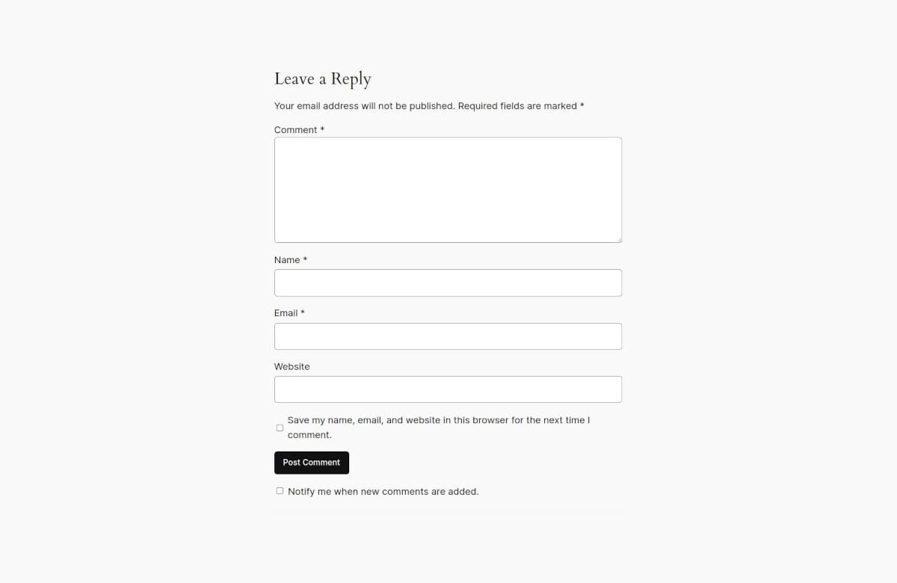
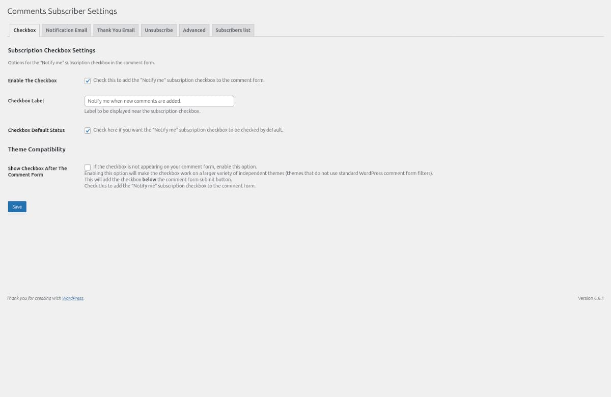
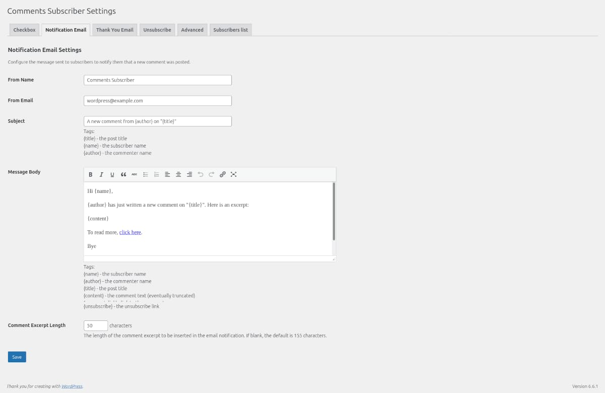
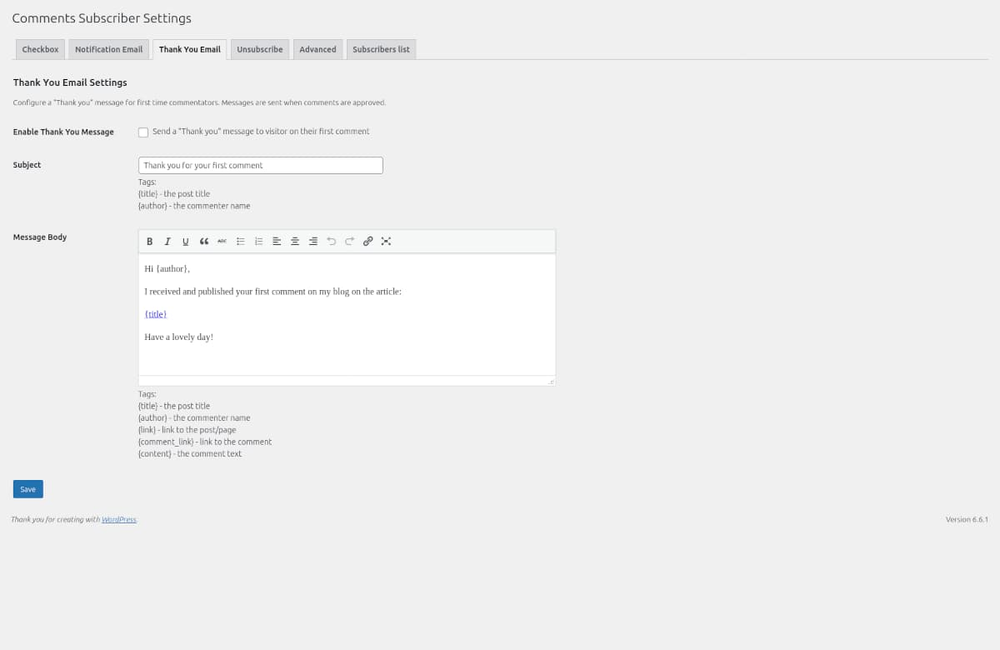
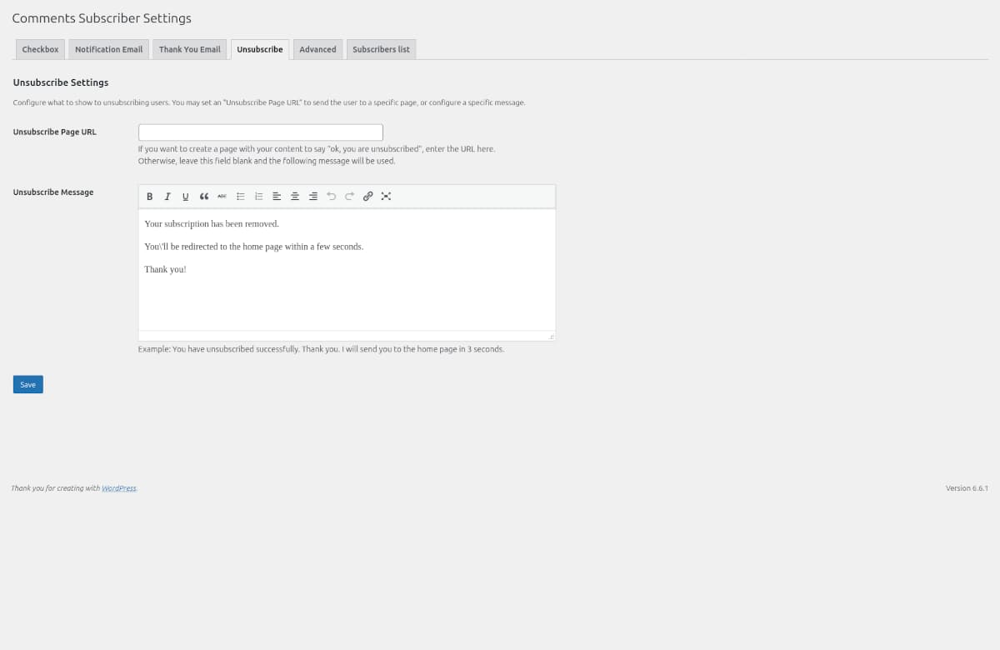
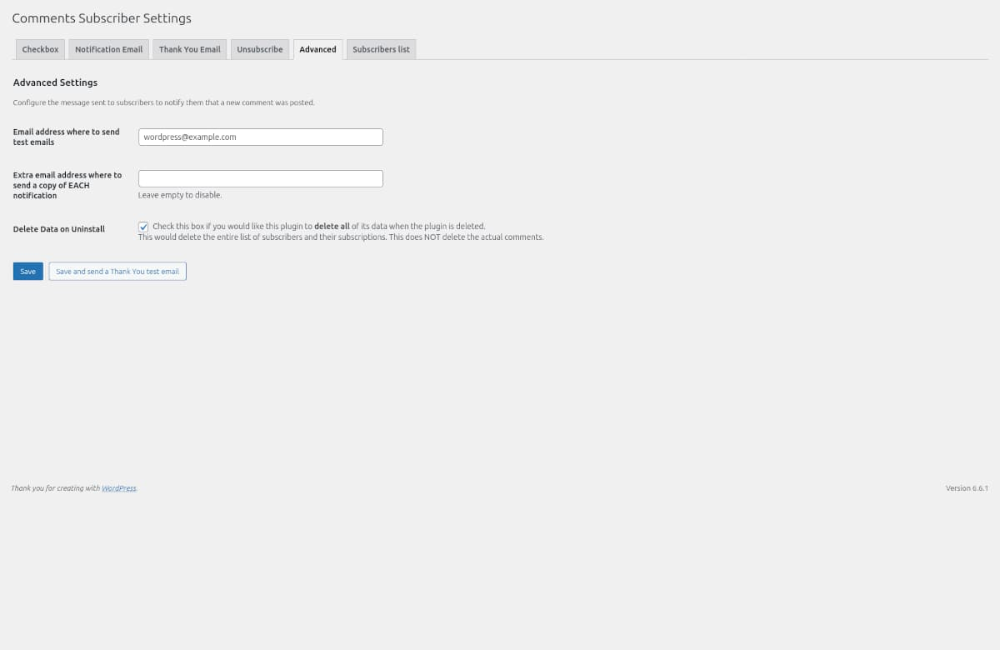
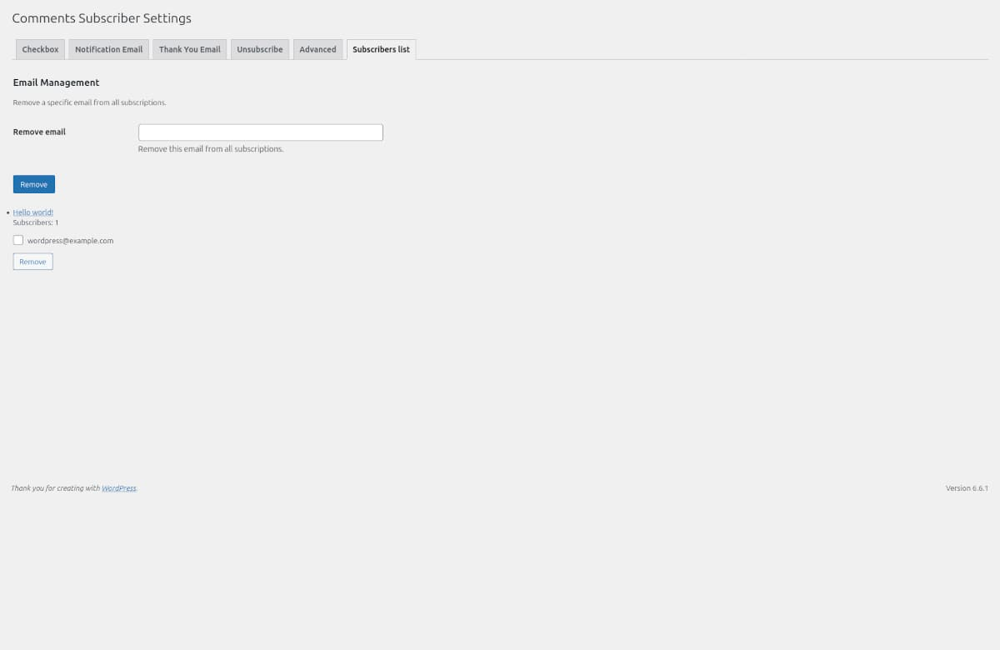

# 

**Contributors:** xlthlx \
**Donate link:** https://paypal.me/xlthlx \
**Tags:** comments,subscribe,follow,notifications \
**Requires at least:** 5.9 \
**Tested up to:** 6.8 \
**Requires PHP:** 8.2 \
**Stable tag:** 1.0.4 \
**License:** GPLv3 or later \
**License URI:** https://www.gnu.org/licenses/gpl-3.0.html

Set up a subscription checkbox to receive an email every time someone comments on the same post.

## Description

Comments Subscriber is a WordPress plugin that simply adds a subscription checkbox to your WordPress comments form to let your visitors subscribe to comments.
They will then be notified by email when others comment on the same post. Works automatically upon activation, no settings required.

## Installation

N/A

## Frequently Asked Questions

N/A

## Screenshots

### 1. Comments form checkbox

### 2. Checkbox settings

### 3. Notification email settings

### 4. Thank you email settings

### 5. Unsubscribe settings

### 6. Advanced settings

### 7. Subscribers list

## Changelog

### 1.0.4

* Tested up to 6.8
* Updated dependencies

### 1.0.3

* Bugfix: option checked by default

### 1.0.2

* Bugfix: subscriptions list and remove
* Updated dependencies

### 1.0.1

* Tested up to 6.7
* Updated dependencies

### 1.0

* First release

## Upgrade Notice

N/A

## Licence

Comments Subscriber is distributed in the hope that it will be useful, but WITHOUT ANY WARRANTY; without even the implied warranty of MERCHANTABILITY or FITNESS FOR A PARTICULAR PURPOSE. See the GNU General Public License for more details. You should have received a copy of the GNU General Public License along with Comments Subscriber.
If not, see https://www.gnu.org/licenses/gpl-3.0.html.

## Support

If you need support or have a feature request, please use the [support forum](https://wordpress.org/support/plugin/comments-subscriber/).
